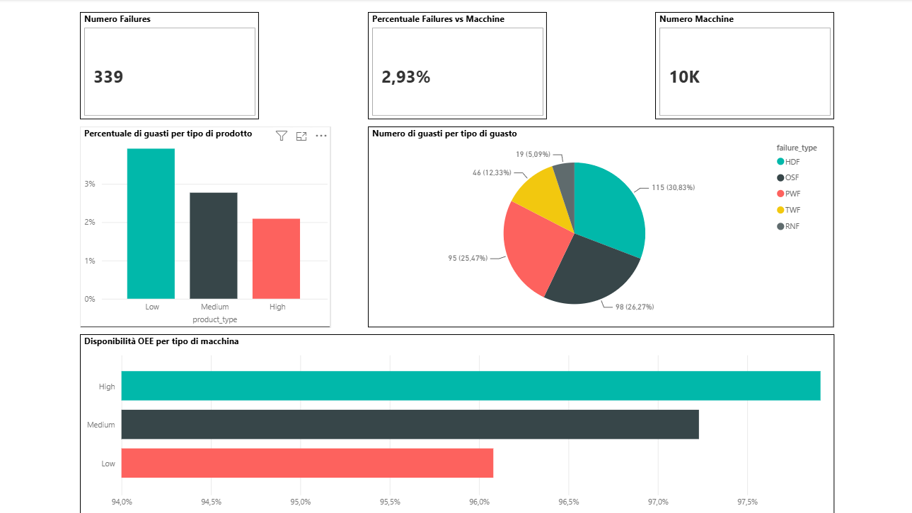
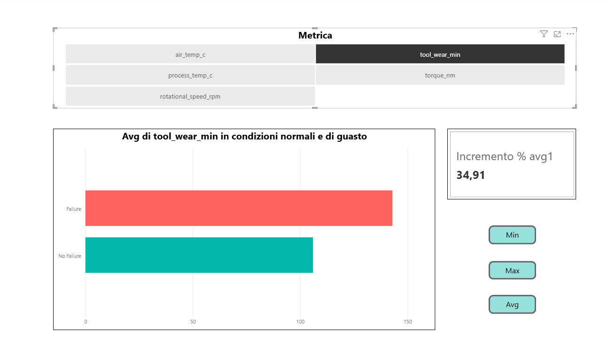
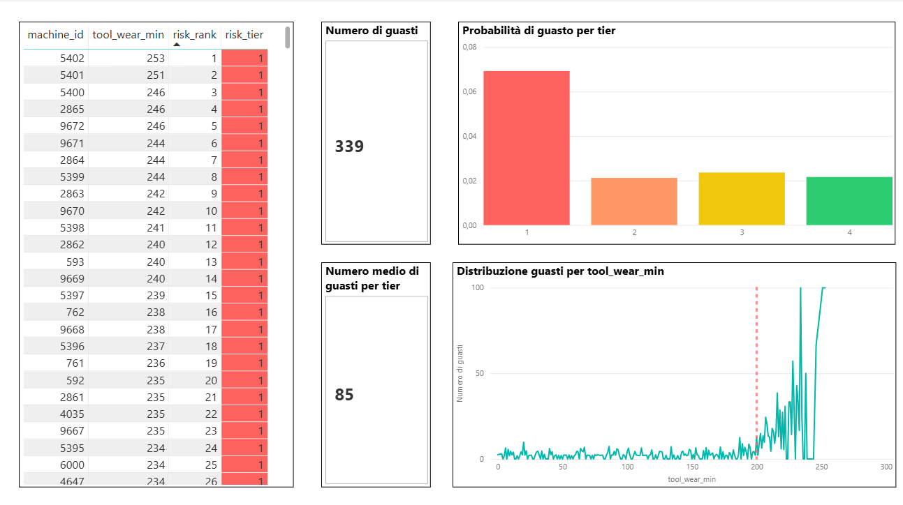

# Manufacturing OEE Dashboard

## 1. Sommario Esecutivo
Progetto di analisi end-to-end su un dataset di produzione manifatturiera composto da 10.000 record macchina.
L'obiettivo è identificare le cause dei guasti agli impianti, monitorare la disponibilità OEE e fornire
raccomandazioni operative al management per ridurre i fermi macchina e ottimizzare le performance produttive.

---

## 2. Problema di Business
Uno stabilimento manifatturiero registra guasti ricorrenti su più linee di produzione.
Il responsabile di stabilimento ha necessità di rispondere a queste domande:
- Quali categorie di prodotto sono più soggette a guasti?
- Quali sono i failure mode più critici e come si distribuiscono?
- In quali condizioni operative si verificano i guasti?
- Quali macchine devono essere prioritizzate per la manutenzione preventiva?

---

## 3. Metodologia
Il progetto segue l'**Architettura Medallion** (Bronze → Silver → Gold) su SQL Server.

Il **Bronze Layer** contiene il dato grezzo ingestito dalla fonte senza trasformazioni. In questa fase sono stati eseguiti controlli completi di qualità del dato: verifica valori nulli, duplicati, outlier sulle colonne numeriche e distribuzione delle variabili categoriche.

Il **Silver Layer** si occupa della pulizia e standardizzazione del dato: rinomina delle colonne per leggibilità, conversione delle temperature da Kelvin a Celsius ed espansione dei codici prodotto (L/M/H → Low/Medium/High).

Il **Gold Layer** espone viste analitiche business-ready che alimentano direttamente la dashboard Power BI: failure rate per tipo di prodotto e per tipo di guasto, disponibilità OEE, condizioni operative durante failure vs no failure, machine risk ranking con segmentazione NTILE(4) e failure rate per fascia di tool wear.

La **dashboard Power BI** è strutturata in 3 pagine: Failure Overview, Root Cause Analysis e Machine Risk.

---

## 4. Competenze Tecniche
| Area | Strumenti e Tecniche |
|---|---|
| Architettura dati | Medallion Architecture (Bronze/Silver/Gold) |
| Storage | SQL Server |
| Trasformazione dati | SQL — CTE, Window Functions (ROW_NUMBER, NTILE), CASE WHEN, UNION ALL |
| Qualità del dato | Null check, duplicate check, outlier detection, distribuzione categorica |
| Reporting | Power BI — Misure DAX dinamiche, formattazione condizionale, segnalibri, slicer |

---

## 5. Risultati

### Failure Overview
Il failure rate complessivo dello stabilimento è del **2.93%**, con 339 guasti su 10.000 macchine analizzate. L'analisi per categoria di prodotto evidenzia una correlazione inversa tra qualità e tasso di guasto: i prodotti Low quality registrano il failure rate più elevato (3.92%), seguiti da Medium (2.77%) e High (2.09%). Questa differenza si riflette direttamente sulla disponibilità OEE, che varia dal 96.08% per i prodotti Low fino al 97.91% per i prodotti High. Sebbene lo scarto appaia contenuto in termini assoluti, su scala industriale una differenza dell'1.83% si traduce in un numero significativo di ore macchina perse.

Sul fronte dei failure mode, il guasto più frequente è HDF (Heat Dissipation Failure) con il 30.83% dei guasti totali, seguito da OSF (26.27%) e PWF (25.47%). I tre failure mode principali coprono complessivamente oltre l'82% di tutti i guasti, rendendo TWF e RNF fenomeni marginali. 

### Root Cause Analysis
Il confronto delle condizioni operative è stato effettuato calcolando i valori medi di ogni parametro separatamente per i macchinari che hanno registrato un guasto e per quelli che non lo hanno registrato. Dall'analisi emergono due driver principali: il torque medio dei macchinari guasti è di 50.17 Nm contro 39.63 Nm dei macchinari senza guasto, con una media superiore del 26.6%. L'usura media dell'utensile è di 143 minuti nei macchinari guasti contro 106 minuti in quelli integri, con una media superiore del 34.9%. Le variazioni termiche invece risultano minime tra i due gruppi e non sembrano costituire un driver primario.

Questo risultato è apparentemente in contraddizione con la frequenza elevata di HDF: nonostante il guasto termico sia il più comune, le temperature medie operative non mostrano differenze significative tra i due gruppi. Una possibile spiegazione è che i guasti termici siano innescati da condizioni meccaniche anomale a monte — come il sovraccarico di torque o l'eccessiva usura dell'utensile — piuttosto che da condizioni termiche ambientali anomale.

### Machine Risk
Le 10.000 macchine sono state rankate per livello di rischio in base al tool wear e segmentate in 4 tier. Le macchine in Tier 1 mostrano una probabilità di guasto di circa il 7%, più che tripla rispetto agli altri tier che si attestano intorno al 2%. La discontinuità netta tra Tier 1 e gli altri tier conferma che l'usura dell'utensile è un predittore affidabile del rischio di guasto.

L'analisi della distribuzione dei guasti per tool wear evidenzia inoltre un punto di rottura netto a 200 minuti: al di sotto di questa soglia i guasti sono rari e distribuiti uniformemente, mentre oltre i 200 minuti il failure rate cresce in modo esponenziale. Questo suggerisce l'opportunità di definire una policy di manutenzione preventiva per tutte le macchine che superano questa soglia.

---

## 6. Prossimi Passi
- Arricchire il dataset con una colonna temporale per abilitare analisi time-series e monitoraggio dei trend
- Analizzare la correlazione tra tipo di guasto e categoria di prodotto per identificare pattern specifici per linea produttiva
- Sviluppare un modello di manutenzione predittiva in Python per anticipare i guasti prima che si verifichino
- Integrare dati in tempo reale da sensori IoT per rendere la dashboard operativa in produzione

---

## Dashboard Preview

### Failure Overview

### Root Cause Analysis

### Machine Risk

## Come utilizzare la Dashboard

Per esplorare la dashboard in modo interattivo, scaricare il file `.pbix` dalla cartella `powerbi/` 
e aprirlo con **Power BI Desktop** (scaricabile gratuitamente da [qui](https://powerbi.microsoft.com/it-it/desktop/)).
I dati sono già incorporati nel file — non è necessario installare SQL Server o scaricare file aggiuntivi.

---

## Autore
**Mattia Falco**
- LinkedIn: www.linkedin.com/in/mattia-falco-4b8b3033b 
- GitHub: https://github.com/Mattia2220/manufacturing-oee-dashboard
